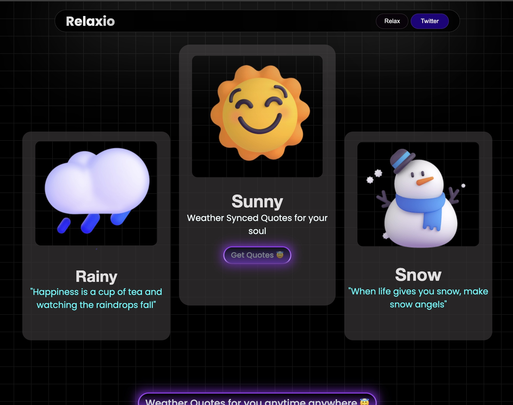
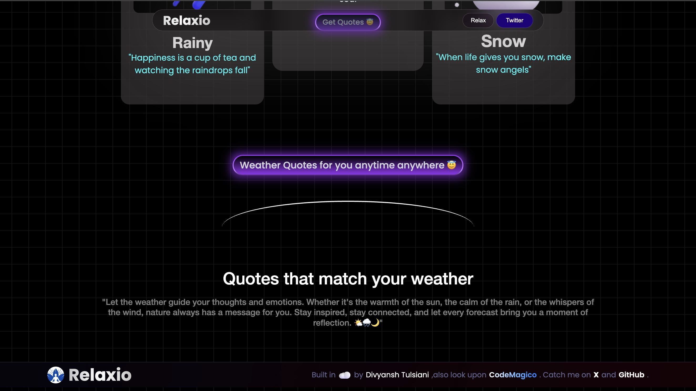

# 🌿 Relaxio – Your Personalized Relaxation Companion  

**Relaxio** is a web-based application that provides soothing and inspirational quotes based on the current weather. Whether it's a rainy afternoon, a sunny morning, or a chilly winter night, Relaxio delivers the perfect words to match the mood of the moment. 

## ✨ Features  
- 🎵 **Weather-Based Quotes** – Automatically selects calming quotes based on real-time weather conditions.   
- 🎨 **Minimalistic & Aesthetic UI** – A clean and distraction-free interface for a seamless experience.  
- ☁️ **Cloud Sync (Upcoming)** – Save your favorite quotes and preferences for easy access anywhere.  

# Live Preview 🌐

[Relaxio](https://relaxioo.netlify.app/)

# Quick Peek

## 🚀 Getting Started  
Simply visit the website, allow location access for weather detection, and let Relaxio curate the perfect quote for you.  

## 🔧 Technologies Used  
- HTML, CSS, JavaScript  
- Weather API Integration  
- Quote API 

Take a break, breathe, and let **Relaxio** take you on a journey of tranquility! 🌸  
